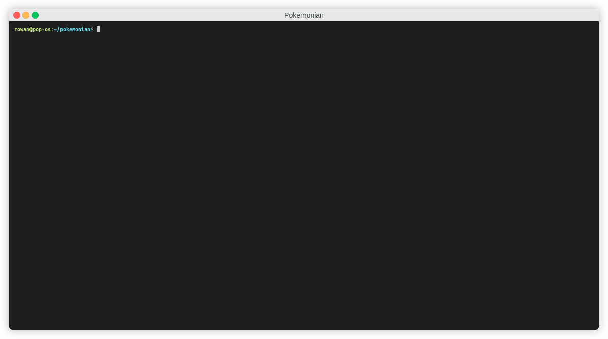
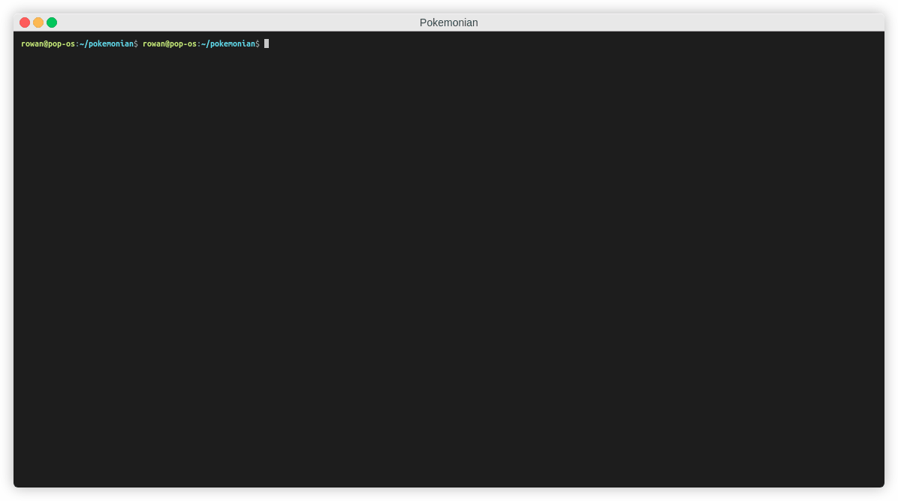

# Pokemonian

### Overview:

This is a small program that crawls [pokeapi.co](https://pokeapi.co) for pokemon and stores them in a postgres DB. It then provides an API to access these pokemon. 

  
 Original spec for the project: 

# Your challenge

- Create an api crawler and stores Pokémon in a database
- New Pokémon are being discovered all the time, and we're learning more and more about existing Pokémon, so it's important your crawler can catch new Pokémon and update facts about existing ones
- We know this won't be the first ever crawler, but we want you to create a version of your own and make it with a personal touch
- We are interested in your creativity and the way you write code
- Accompanying the project would be great to have a brief "explainer" on your thoughts towards the design, implementation, scaling, testing and any other considerations made

## **Requirements**

- Use this api [https://pokeapi.co/](https://pokeapi.co/) to learn about where to find the Pokémon.
- Create a python application which creates and persists Pokémon
- Choose an approach to present the crawled data
    - API
    - Django Administration
    - Page templates

## **Application Requirements:**

- Build an application that can discover all the Pokémon from the PokeAPI 
- Demonstrate or consider your approach to testing / TDD.
- The code can be sent as a public or private git repo.
- Store Pokémon (design your own schema) and some attributes:
    1. Pokémon name
    2. Description
    3. Choose some of it's characteristics like: Stats, Abilities, Movements etc ... maximum 5
- **Spend no more than 2 hours on this**, we might like Pokémon but we appreciate you have other things to do, so leave plenty for us to talk about face to face.

### Usage:
Easiest way of running this is using [just](https://github.com/casey/just). This is a tool used to run commands, similar to make. You can of course run the commands yourself that are in the justfile, but you'll have to substitute in the `{{image_name}}` and `{{args}}`.

You will also need Docker and docker-compose to be able to run Pokemonian.

* `just run` - Just runs the crawler and api.

Once the crawler has populated the DB, you can access the api with:
* `curl -L 0.0.0.0:8000/pokemon/` - Gets a redirect to `/pokemon/random/` and gets a random pokemon.
* `curl -L 0.0.0.0:8000/pokemon/{id}` - Gets a specific pokemon.
* `curl -d '{"id":10000, "name":"randomamon", "url":"randomurl"}' -H "Content-Type: application/json" -X POST http://0.0.0.0:8000/pokemon` - This creates a new pokemon with the data passed in from the json. The keys must match the pokemon model object.

Development: 
* `just debug` - Runs the crawler and API, and the crawler will output debug logs.
* `just update_reqs` - Update the poetry lockfile if you change the requirements.
* `just test` - Runs the test suite
* `just _remove_postgres_db` - Delete the contents of the DB (including the table).

---

### Server:

### Client:

### Test:

---

Database schema:

| pokemon | type          |
|:--------|:--------------|
| id (PK) | int           |
| name    | str           |
| url     | str           |
| height  | optional(int) |
| weight  | optional(int) |
| speed   | optional(int) |
